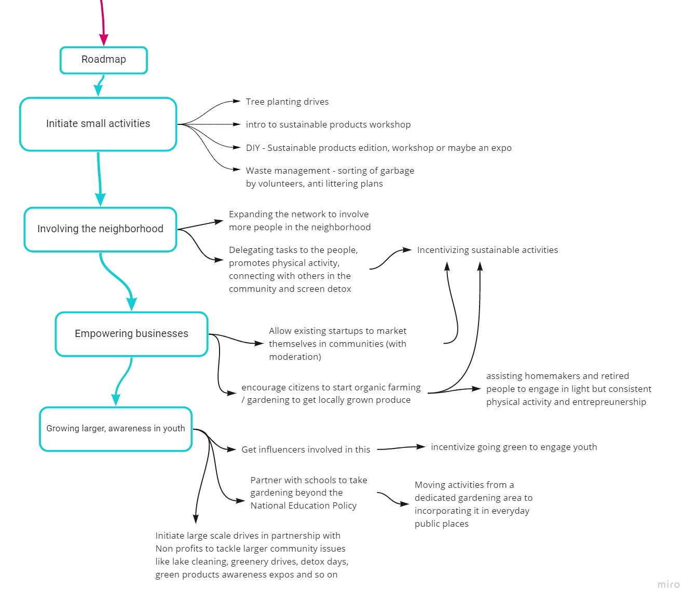

# go-minimal

A social good project that focuses on reducing the carbon footprints of individuals and encourage them to actively contribute to protecting the environment.

## How I built it

I used Adobe XD to work on the prototype of the website from scratch. My research and brainstorming behind this idea were all done on Miro.

- Prototype link: https://xd.adobe.com/view/c20d82c2-1a04-461e-8f66-6cc1e5c7a8a4-975e/?fullscreen
- Link to XD File: https://drive.google.com/file/d/1uHre50CbPmwzzyuEYMyDUBYkQhPcjyrn/view?usp=sharing

## Brainstorming and UX work

<iframe width="768" height="432" src="https://miro.com/app/live-embed/o9J_lQlAquY=/?moveToViewport=-2460,-1132,1716,1013" frameBorder="0" scrolling="no" allowFullScreen></iframe>

